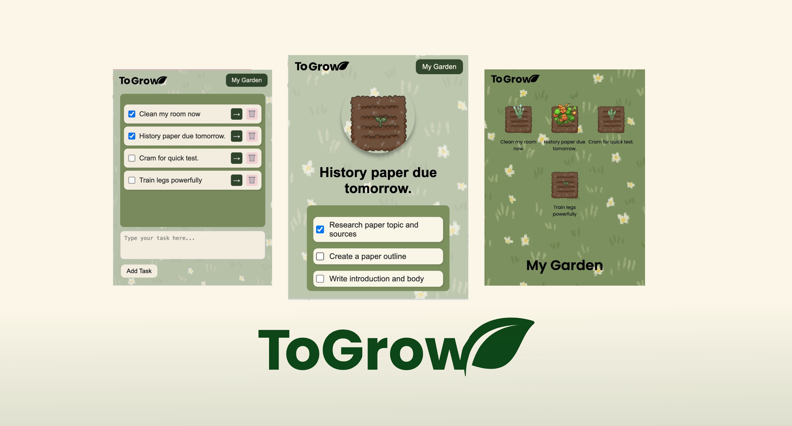

# 🌸 ToGrow 🌸



## 💡 About ToGrow
ToGrow is an **AI-powered Chrome extension** developed during cmd-f 2025 that helps **neurodivergent individuals** break down overwhelming tasks into smaller, manageable steps. Task planning can be difficult for those with ADHD, autism, or executive function challenges, so we built a tool to make productivity feel more achievable.

## 🌱 Key Features
- **AI Task Breakdown**: Powered by Gemini API to transform large tasks into actionable steps
- **User-Friendly Interface**: Simple, intuitive design to reduce cognitive load
- **Chrome Extension Format**: Easily accessible while working on any website
- **Plant Growth Visualization**: Visual representation of progress to provide positive reinforcement
- **Chrome Sync Storage**: Syncs tasks across devices, reducing need for backend storage

## 🏆 Recognition
ToGrow was recognized as one of the top projects at cmd-f 2025 hackathon hosted by nwPlus at UBC!

## 🛠️ Technologies Used
- **Backend**: Flask (Python)
- **Frontend**: HTML, CSS, JavaScript
- **AI Integration**: Gemini API
- **Art Assets**: Hand-drawn plant assets created in Krita

## 📱 Demo & Links
- [Demo Video](https://youtu.be/Vro6ysWF6G4?si=Na4b3zgl3VZcqMA7)
- [DevPost Submission](https://devpost.com/software/togrow)

## 👥 Our Team
This project was a collaborative effort by:
- **[Myself](https://github.com/stuffedpotato)**: Backend development (Flask), API integration (Gemini), frontend (JavaScript), and debugging CORS issues
- **[Melissa Goon](https://github.com/melissagoon)**: Backend (Flask, Python) & frontend (HTML, CSS, JavaScript), project pitch, and hand-drawn plant assets in Krita
- **[Grace B](https://github.com/graceb)**: Frontend development (CSS & HTML first-timer) and UI design
- **[Anisa](https://github.com/anisa888anny)**

## 🧠 What I Learned
cmd-f 2025 was my first hackathon experience. Through this project, I learned:
- Flask for backend development
- Implementing and using AI APIs (Gemini)
- Frontend web development
- Debugging cross-origin resource sharing (CORS) issues
- Collaborative development under time constraints

## 📋 Installation & Setup

1. Clone this repository
   ```bash
   git clone https://github.com/stuffedpotato/cmdf-to-grow.git

2. Navigate to the project directory
   ```bash
   cd cmdf-to-grow

3. Set up the backend (requires Python)
   ```bash
   pip install -r requirements.txt

4. Run the app (instead of python, use python3 for macOS)
   ```bash
   python app.py
